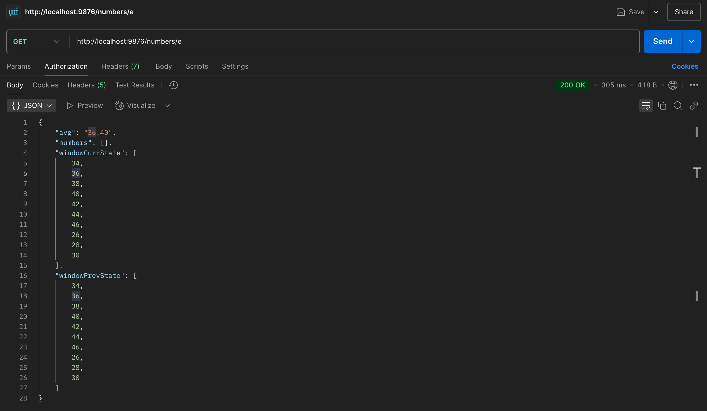

# Average Calculator Microservice

A Flask microservice that fetches numbers from a third-party API, stores them in a fixed-size window, and calculates their average.

## API Endpoint

*   `GET /numbers/{number_id}`
    *   `number_id`:
        *   `p`: Prime numbers
        *   `f`: Fibonacci numbers
        *   `e`: Even numbers
        *   `I`: Random numbers

## Setup

1.  **Prerequisites:** Python 3.7+
2.  **Create Virtual Environment (recommended):**
    ```bash
    python3 -m venv venv
    source venv/bin/activate  # On Windows: venv\Scripts\activate
    ```
3.  **Install Dependencies:**
    ```bash
    pip install -r requirements.txt
    ```
4.  **Configure Environment:**
    Create a `.env` file in the root directory with the following content:
    ```env
    BEARER_TOKEN="YOUR_FRESH_API_BEARER_TOKEN"
    WINDOW_SIZE=10 # Optional, defaults to 10
    ```
    Replace `"YOUR_FRESH_API_BEARER_TOKEN"` with a valid token for the test server. These tokens expire quickly.

## Running the Service

```bash
python app.py
```

