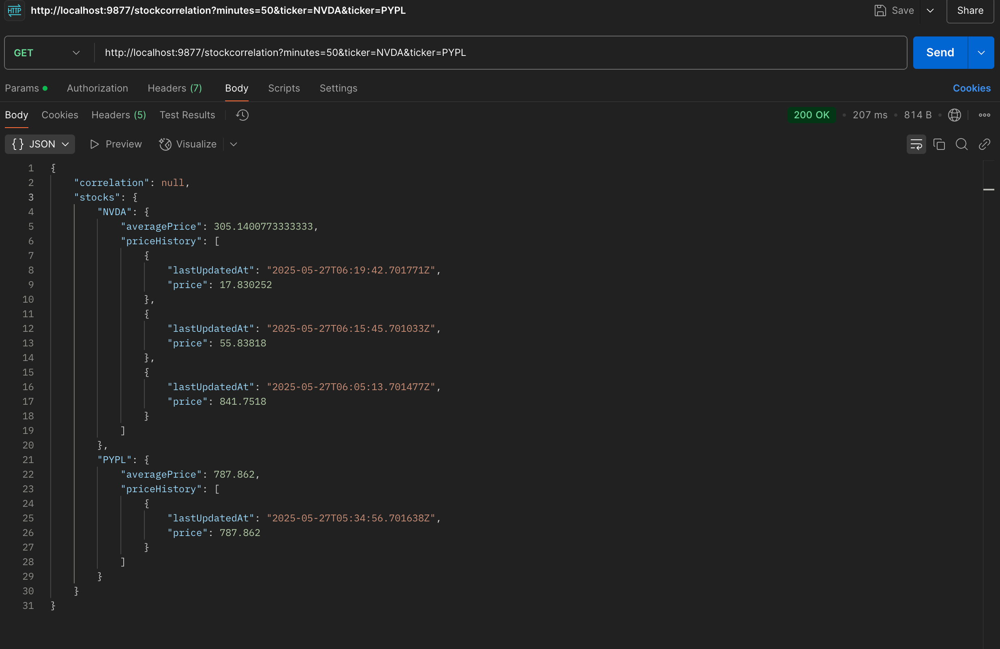

# Stock Price Aggregation Microservice

A Flask microservice that fetches stock price data from a test exchange API, caches it, and provides insights like average price and correlation between two stocks.

**Prerequisites:**

*   Python 3.7 or higher installed.
*   `pip` (Python package installer) available.

**Steps to Install:**

1.  **Navigate to the Project Directory:**
    Open your terminal or command prompt and change to the root directory of this microservice project (where the `requirements.txt` file is located).
    ```bash
    cd path/to/your/stock-aggregation-microservice
    ```

2.  **(Recommended) Create and Activate a Virtual Environment:**
    It's highly recommended to use a virtual environment to manage project-specific dependencies, preventing conflicts with other Python projects.

    *   **Create the virtual environment (if it doesn't exist):**
        ```bash
        python3 -m venv venv
        ```
        (You can name it `venv` or something else like `.venv`.)

    *   **Activate the virtual environment:**
        *   **On macOS and Linux:**
            ```bash
            source venv/bin/activate
            ```
        *   **On Windows (Command Prompt):**
            ```bash
            venv\Scripts\activate.bat
            ```
        *   **On Windows (PowerShell):**
            ```bash
            .\venv\Scripts\Activate.ps1
            ```
        Your terminal prompt should change to indicate the virtual environment is active (e.g., `(venv) your-prompt$`).

3.  **Install Packages using `requirements.txt`:**
    With the virtual environment activated, run the following command:
    ```bash
    pip install -r requirements.txt
    ```
    This command will read the `requirements.txt` file and install all the listed packages and their specific versions (or minimum versions).


## API Endpoints

1.  **Average Stock Price**
    *   **Method:** `GET`
    *   **Route:** `/stocks/<ticker>?minutes=m&aggregation=average`
        *   `<ticker>`: The stock ticker symbol (e.g., NVDA, AAPL).
        *   `minutes=m`: The number of past minutes to consider for the price history.
        *   `aggregation=average`: (Currently, only 'average' is supported).
    *   **Example:** `http://localhost:9877/stocks/NVDA?minutes=30&aggregation=average`

2.  **Stock Correlation**
    *   **Method:** `GET`
    *   **Route:** `/stockcorrelation?minutes=m&ticker=<TICKER1>&ticker=<TICKER2>`
        *   `minutes=m`: The number of past minutes for the history.
        *   `ticker=<TICKER1>`: The first stock ticker.
        *   `ticker=<TICKER2>`: The second stock ticker (exactly two tickers required).
    *   **Example:** `http://localhost:9877/stockcorrelation?minutes=50&ticker=NVDA&ticker=PYPL`

## Setup

1.  **Prerequisites:** Python 3.7+
2.  **Create Virtual Environment (recommended):**
    ```bash
    python3 -m venv venv
    source venv/bin/activate  # On Windows: venv\Scripts\activate
    ```
3.  **Install Dependencies:**
    ```bash
    pip install -r requirements.txt
    ```
    (Ensure `Flask`, `requests`, `python-dotenv`, `pytz` are in `requirements.txt`)

4.  **Configure Environment:**
    Create a `.env` file in the root directory with the following content:
    ```env
    STOCK_API_BEARER_TOKEN="YOUR_FRESH_BEARER_TOKEN_FOR_STOCK_EXCHANGE_API"
    # WINDOW_SIZE is not used in this project, but other configs could go here.
    ```
    Replace `"YOUR_FRESH_BEARER_TOKEN_FOR_STOCK_EXCHANGE_API"` with a **valid and recently generated Bearer token** for the test stock exchange API (`http://20.244.56.144/evaluation-service/...`). These tokens often expire very quickly.

## Running the Service

```bash
python app.py
```


